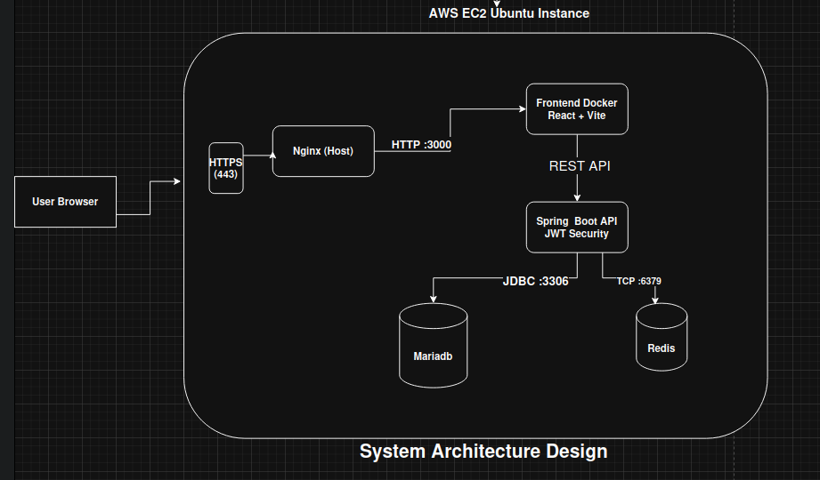

# Weather App ☁️

A full-stack Weather Application deployed on AWS EC2 using Docker, Spring Boot, React, MariaDB, Redis, Nginx, JWT Authentication, and HTTPS via Let's Encrypt.

## Live Demo

**URL:** https://kaifkazmi.duckdns.org

---

# Features

### Authentication

* User Registration
* User Login
* JWT-based Authentication
* Spring Security Integration

### Weather Services

* Current Weather Information
* Protected Weather API Endpoints
* External Weather API Integration

### Infrastructure

* Dockerized Services
* Docker Compose Orchestration
* Reverse Proxy with Nginx
* HTTPS with Let's Encrypt
* Redis Caching
* MariaDB Persistence
* AWS EC2 Deployment

---

# Tech Stack

## Frontend

* React
* Vite
* JavaScript
* Axios

## Backend

* Spring Boot 4
* Spring Security
* JWT Authentication
* Spring Data JPA

## Database

* MariaDB

## Cache

* Redis

## DevOps

* Docker
* Docker Compose
* Nginx
* Certbot
* AWS EC2

---

# System Architecture



# Domain & SSL

Domain:

kaifkazmi.duckdns.org

SSL Provider:

Let's Encrypt

HTTPS Enabled:

```text
https://kaifkazmi.duckdns.org
```

---

# Project Structure

```text
Weather-App/
│
├── frontend/
│   ├── src/
│   ├── public/
│   ├── Dockerfile
│   └── vite.config.js
│
├── backend/
│   ├── src/
│   ├── Dockerfile
│   └── pom.xml
│
├── docker-compose.yml
├── .env
└── README.md
```

---

# Docker Compose Services

```yaml
services:
  mariadb:
  redis:
  backend:
  frontend:
```

---

# Environment Variables

Create a `.env` file in the project root.

```env
JWT_SECRET=your_jwt_secret

WEATHER_API_KEY=your_weather_api_key

DB_URL=jdbc:mariadb://mariadb:3306/weather_app
DB_USERNAME=student
DB_PASSWORD=Pass@123

REDIS_HOST=redis
REDIS_PORT=6379
```

---

# Database Configuration

```env
MARIADB_DATABASE=weather_app
MARIADB_USER=student
MARIADB_PASSWORD=Pass@123
```

---

# Running Locally

## Clone Repository

```bash
git clone <repository-url>
cd Weather-App
```

## Start Application

```bash
docker compose up -d --build
```

Verify containers:

```bash
docker ps
```

---

# Backend Configuration

Datasource:

```properties
spring.datasource.url=${DB_URL}
spring.datasource.username=${DB_USERNAME}
spring.datasource.password=${DB_PASSWORD}
```

Redis:

```properties
spring.data.redis.host=${REDIS_HOST}
spring.data.redis.port=${REDIS_PORT}
```

---

# AWS EC2 Deployment

## Install Docker

```bash
sudo apt update
sudo apt install docker.io -y
```

Enable Docker:

```bash
sudo systemctl enable docker
sudo systemctl start docker
```

---

## Clone Project

```bash
git clone <repository-url>
cd Weather-App
```

---

## Create Environment File

```bash
nano .env
```

Add required environment variables.

---

## Run Containers

```bash
docker compose up -d --build
```

---

# Nginx Configuration

## HTTP → HTTPS Redirect

```nginx
server {
    listen 80;
    server_name kaifkazmi.duckdns.org;

    return 301 https://$host$request_uri;
}
```

## HTTPS Configuration

```nginx
server {
    listen 443 ssl;
    http2 on;

    server_name kaifkazmi.duckdns.org;

    ssl_certificate /etc/letsencrypt/live/kaifkazmi.duckdns.org/fullchain.pem;
    ssl_certificate_key /etc/letsencrypt/live/kaifkazmi.duckdns.org/privkey.pem;

    location / {
        proxy_pass http://localhost:3000;

        proxy_set_header Host $host;
        proxy_set_header X-Real-IP $remote_addr;
        proxy_set_header X-Forwarded-For $proxy_add_x_forwarded_for;
        proxy_set_header X-Forwarded-Proto $scheme;
    }
}
```

Test configuration:

```bash
sudo nginx -t
sudo systemctl restart nginx
```

---

# SSL Certificate

Generate certificate:

```bash
sudo certbot certonly --standalone \
-d kaifkazmi.duckdns.org
```

Certificate location:

```text
/etc/letsencrypt/live/kaifkazmi.duckdns.org/
```

Files:

```text
fullchain.pem
privkey.pem
```

---

# CORS Configuration

Allowed Origins:

```java
configuration.setAllowedOrigins(
    List.of(
        "http://localhost:8080",
        "http://localhost:3000",
        "https://kaifkazmi.duckdns.org",
        "http://kaifkazmi.duckdns.org"
    )
);
```

---


## Future Enhancements

* Fix duplicate user issue
* Verify JWT Authentication Flow
* Verify Protected Endpoints
* Allocate AWS Elastic IP
* Update DuckDNS Record
* Configure Automatic SSL Renewal
* CI/CD Pipeline
* GitHub Actions Deployment
* Monitoring & Logging

---

# Troubleshooting

## Verify Running Containers

```bash
docker ps
```

## View Backend Logs

```bash
docker logs backend
```

## View Frontend Logs

```bash
docker logs frontend
```

## Verify Nginx

```bash
sudo nginx -t
```

## Check HTTPS Port

```bash
sudo ss -tlnp | grep :443
```

---

# Author

Kaif Kazmi

Built using:
React • Spring Boot • MariaDB • Redis • Docker • Nginx • AWS EC2
